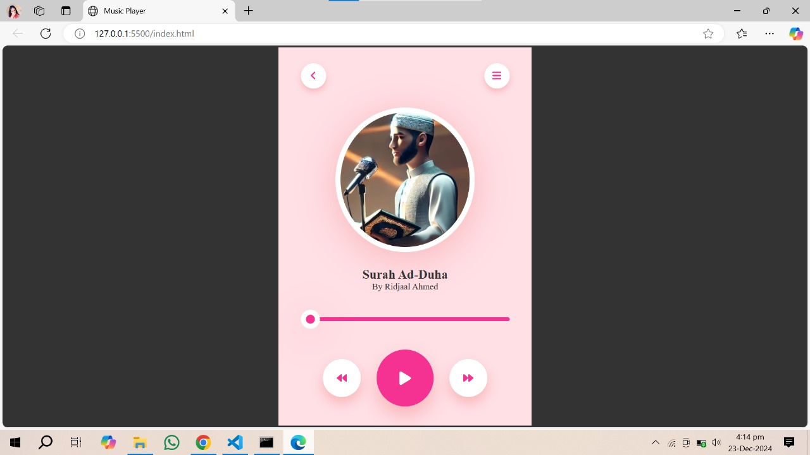

# Music Player App 🎵🎶

Welcome to the **Music Player App**! This simple yet elegant music player allows you to enjoy your favorite audio tracks with an intuitive and stylish interface. Built using **HTML**, **CSS**, and **JavaScript**, it’s perfect for learning or enhancing your web development skills. 🚀

---

## Features ✨

- **Responsive Design** 📱: Fully responsive and mobile-friendly design.
- **Custom Controls** 🎛️: Play, pause, seek, and navigate through the track.
- **Interactive UI** 🎨: Vibrant colors and smooth animations.
- **Range Slider** 🎚️: Visual progress bar to control the playback.

---

## How to Use 🛠️

1. Clone or download this repository to your local machine.
   ```bash
   git clone <repository-url>
   ```

2. Open the `index.html` file in your favorite browser.

3. Ensure you have the following files in the same directory:
   - `index.html`
   - `style.css`
   - `script.js`
   - An audio file (e.g., `093.mp3`).
   - An image file (e.g., `image.jpg`).

4. Enjoy the music! 🎧

---


## Screenshot 📸

 

---

## Future Enhancements 🚀

- Add a playlist feature to manage multiple tracks. 📂
- Include volume control and mute options. 🔊
- Implement shuffle and repeat functionalities. 🔁
- Display lyrics alongside the music. 🎤

---

## Technologies Used 🛠️

- **HTML5** for the structure of the app.
- **CSS3** for styling and animations.
- **JavaScript** for dynamic functionality.

---

## Contribution 🤝

Contributions are always welcome! Feel free to fork this repository, make your changes, and submit a pull request. Let’s make this app even better together! 🌟

---

## License 📜

This project is licensed under the MIT License📄. You are free to use, modify, and distribute this software as per the terms of the license.
